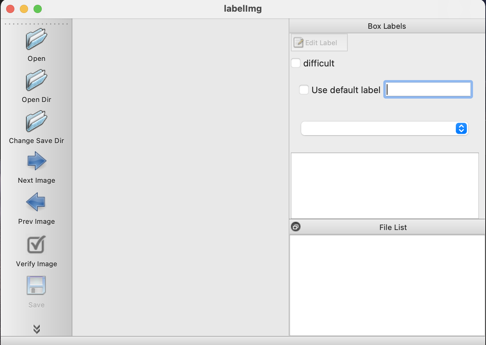
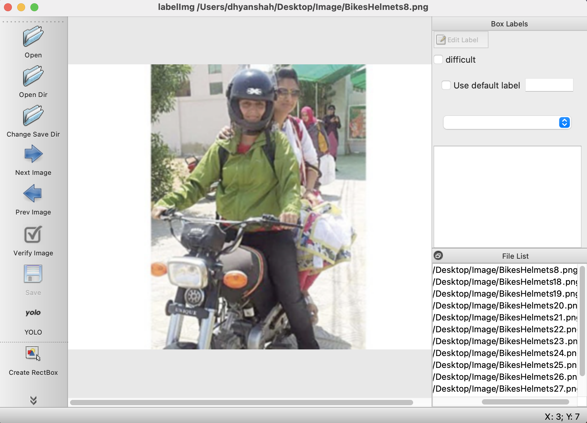
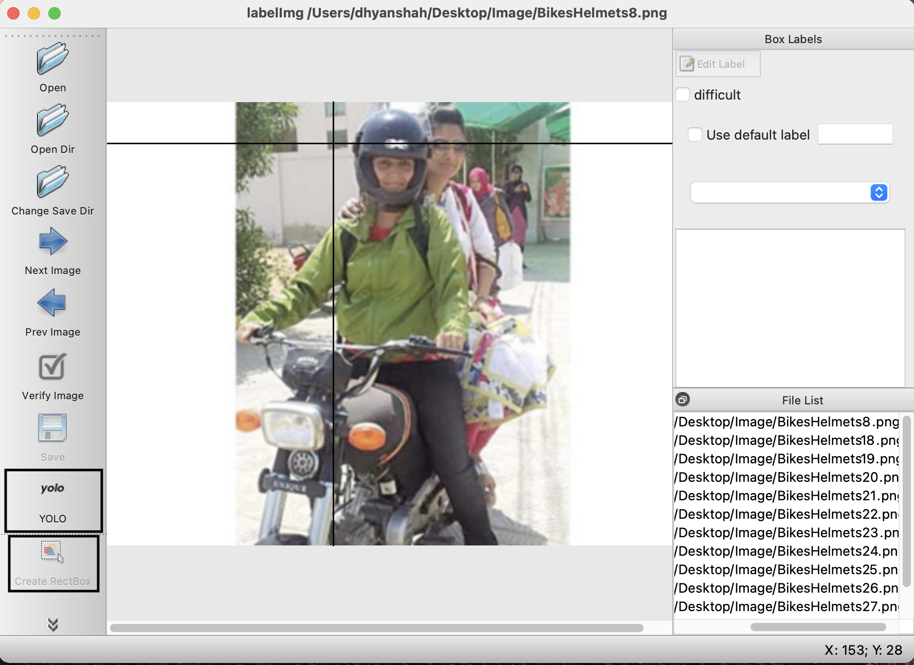
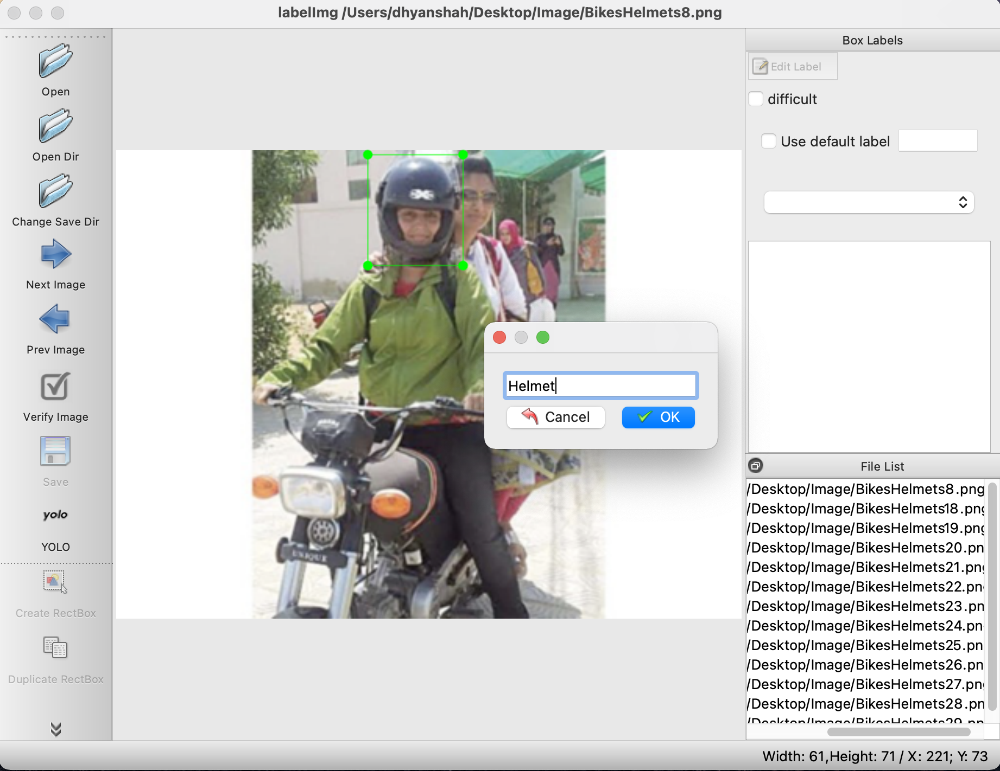
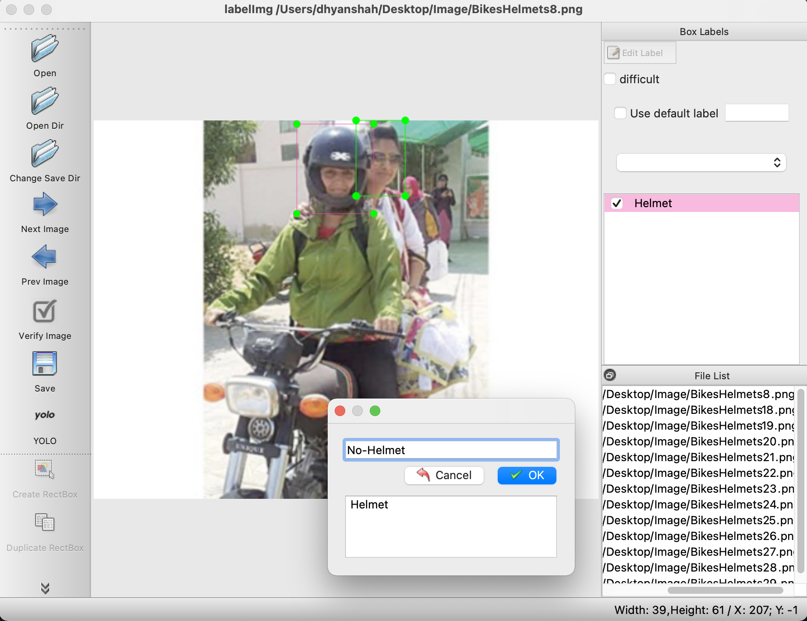
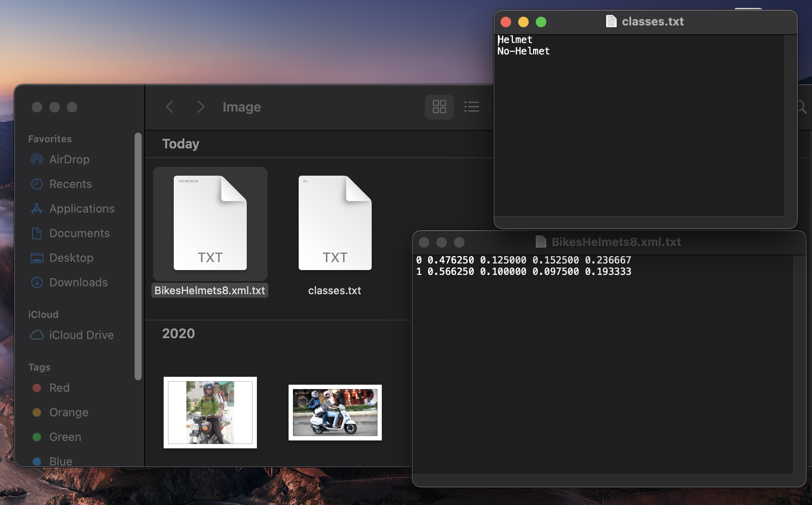

<p align="center">
  <a href="https://github.com/dhyan1999/Helmet-Detection--Computer-Vision-" title="Helmet Detection">
  </a>
</p>
<h1 align="center">🪖 Helmet Detection 🪖</h1>


<p align="center">2021G COMP-5112-GDF - Research Methodolody Computer Science</p>

<h2 align="center">🌐 Links 🌐</h2>
<p align="center">
    <a href="https://youtu.be/ud4P45zhCk0" title="Helmet Detection">🖥️ Video</a>
    ·
    <a href="https://github.com/dhyan1999/Helmet-Detection--Computer-Vision-" title="Helmet Detection">📂 Repo</a>
    ·
    <a href="https://github.com/dhyan1999/Helmet-Detection--Computer-Vision-/blob/main/RM.pdf" title="Helmet Detection">📄 Paper</a>
</p>

## Table of Content

1. [Manifest](#-manifest)
2. [Prerequisites](#-prerequisites)
3. [Installation Steps](#%EF%B8%8F-installation-steps)
4. [Installation of important Libraries](#-installation-of-important-libraries)
5. [Installation of labelImg](#installation-of-labelImg)
6. [Use of labelImg in the project](#Use-of-labelImg-in-the-project)
7. [Implementation of Code](##-implementation-of-code)
8. [Future scope](#-future-scope)

## 🧑🏻‍🏫 Manifest

```
- bike.ipynb --> A python file that run's Helmet-Detection code
- bike.xml   --> A xml file which has the entries of all the co-ordinates of each 
                 image(in the image folder) and has been trained on detecting two classes 
                      1. Helmet
                      2. No Helmet
- README.md ---> This markdown file you are reading.
- Image ----> Image folder has all the images of people wearing and not wearing Helmet
- movie2.mp4 --> These is the movie file on which we are going to run our Helmet-Detection
                 model
                 (Anybody can change this movie file and put there file for testing😀)
```


## 🤔 Prerequisites

- [Python](https://www.python.org/ "Python") Installed

- Python Basics Understanding

- [OpenCV](https://pypi.org/project/opencv-python/ "OpenCV") Library Installed 

- Computer Vision Basic Understanding

## 🛠️ Installation Steps

1. Install [Anaconda](https://www.anaconda.com/products/individual "Anaconda") Software

2. Click on Juypter Notebook

3. Create a seperate folder of any name you want

4. Upload 3 files there bike.ipynb, movie2.mp4 and bike.xml in that folder

5. Run bike.ipynb

**🎇 You are Ready to Go!**

## ❗ Installation of Important Libraries

Before running the .ipynb file we need to import some of the libraries using terminal 

In the Anaconda Terminal, you can run:

```Bash
pip install opencv-python
```

For installing TKinter (If it shows the error that Tkinter is not installed)

```Bash
pip install python-tk
```

## Installation of labelImg

- LabelImg - LabelImg is a free, open source tool for graphically labeling images. It’s written in Python and uses QT for its graphical interface. It’s an easy, free way to label a few hundred images 

- Open Anaconda Terminal and write run command

```Bash
sudo pip3 install labelimg
```


## Use of labelImg in the project 

- Step1 - Write the command labelImg in the Anaconda Terminal which will open a window as shown below.

```Bash
labelimg
```



- Step2 - Open the directory where all the pictures are saved using the 'Open dir' link available on the left hand side. This step will display all the images on right side small window.



- Step3 - Make sure YOLO is selected. Then, select the first picture and choose the command create rectBox. On clicking on rectBox, a rectangle can be drawn around the face of the person. 



- Step4 - In this step, we will create a rectangle box around the person and give it a name depending on whether the person is wearing the helmet or not. If the person is wearing a helmet, class name is given as helmet and if not then the class name is given as no helmet. Now we will save this picture.





- Step5 - Now after saving the picture, a class file and a txt file is formed in the folder. Class file contains the 2 classes (helmet and no helmet) that we made and the txt file contains the coordinates of the rectangle that we made around the person’s face.



- Step6 - Repeat step’s 3, 4 and 5 for the rest of the pictures. It’s important to note that, for every picture the class file will remain same but different txt files will be made. 

- Step7 - So, finally after saving the changes made to the last picture one can see 1 class file and different txt files in the folder. 

- Step8 - We can combine all these txt files into one xml file and we can use that xml file in the code to detect the person wearing helmet.

•	Note – The xml file that we need to use for detection will be a huge file. For training and testing, we will require thousands of pictures. This will take many days to train all pictures. This is a timely task. In my project, therefore, I utilized the predefined data set bike.xml.

## 👨🏻‍💻 Implementation of Code

import libraries of python OpenCV, tkinter, ImageTk

```py
import cv2
import tkinter as tk
from PIL import ImageTk, Image
```

Assigning xml and mp4 file to variables

```py
cascade_src = 'bike.xml'
video_src = 'movie2.mp4'
```

Capture frames from a video

```py
cap = cv2.VideoCapture(video_src)
fgbg = cv2.createBackgroundSubtractorMOG2()
```

Trained XML classifiers describes some features of some object we want to detect

```py
car_cascade = cv2.CascadeClassifier(cascade_src)
```

Set up GUI

```py
window = tk.Tk()  #Makes main window
window.wm_title("Digital Microscope")
window.config(background="#FFFFFF")
```

Graphics window

```py
imageFrame = tk.Frame(window, width=600, height=500)
imageFrame.grid(row=0, column=0, padx=10, pady=2)
```

Capture video frames

```py
lmain = tk.Label(imageFrame)
lmain.grid(row=0, column=0)
```

```py
def show_frame():
	# reads frames from a video
    _, frame = cap.read()

    # convert to gray scale of each frames    
    gray = cv2.cvtColor(frame, cv2.COLOR_BGR2GRAY)

    # Detects bikes of different sizes in the input image
    cars = car_cascade.detectMultiScale(gray, 1.59, 1)
```

To draw a rectangle in each bikes

```py
for (x, y, w, h) in cars:
    cv2.rectangle(frame, (x, y), (x + w, y + h), (0, 255, 215), 2)
    color = cv2.cvtColor(frame, cv2.COLOR_BGR2RGBA)
    img = Image.fromarray(color)
    imgtk = ImageTk.PhotoImage(image=img)
    lmain.imgtk = imgtk
    lmain.configure(image=imgtk)
    lmain.after(10, show_frame)
```

Slider window (slider controls stage position)

```py
sliderFrame = tk.Frame(window, width=600, height=100)
```

## 🎊 Future Scope

- In future this project can be extended to detect the number plates of bikes. 

- Proper GUI

## 🧑🏻 Author

**Dhyan Shah**

- 🌌 [Profile](https://github.com/dhyan1999 "Dhyan Shah")

- 🏮 [Email](mailto:dhyan.shah99@gmail.com?subject=Hi%20from%20Dhyan%20Shah "Hi!")

<p align="center">Made with Python & ❤️ in India</p>
